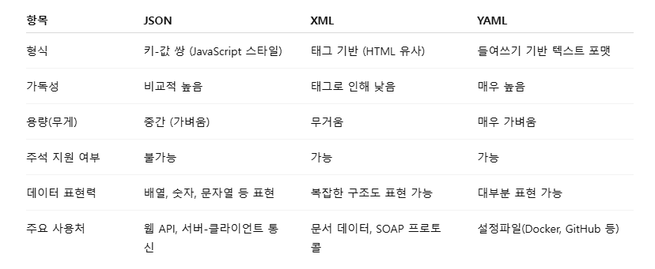

<pre>

<데이터 교환 포맷 및 시리얼라이징 이해>

 * 시리얼라이징이란?

- 객체나 데이터를 문자열이나 바이트로 변환해 저장하거나 전송할 수 있게 만드는 것

- 예: {name: "Tom"} → '{"name":"Tom"}'

* JSON, XML, YAML 비교

1. JSON

- 자바스크립트 기반, 가볍고 빠름

- 웹 API에서 가장 많이 사용됨

- 주석 불가

2. XML

- 태그 구조, 문서 표현에 적합

- 무겁고 복잡함

- 주석 가능

3. YAML

- 들여쓰기 기반, 사람이 읽기 쉬움

- 설정 파일에 많이 사용

- 주석 가능, 하지만 들여쓰기 실수 주의

</pre>

<pre>

* https, SSL 인증서 기초

1. HTTPS란?

- HTTP에 보안(암호화) 기능이 추가된 통신 방식

-> 사용자의 정보가 도청·위조되지 않도록 보호

2. SSL 인증서란?

-사이트의 신원을 인증하고, 암호화 통신을 가능하게 하는 증명서

-> 브라우저와 서버 사이에 안전한 연결을 만들어줌

3. 작동 방식 요약

1)사용자가 HTTPS 사이트 접속

2)서버가 SSL 인증서 전달

3)브라우저가 인증서 확인

4)안전한 암호화 통신 시작

4. 왜 HTTPS를 써야 하나?

- 개인정보 보호

- 데이터 위조 방지

- 브라우저 신뢰 표시 (자물쇠 아이콘)

- 검색 순위 우대

</pre>
