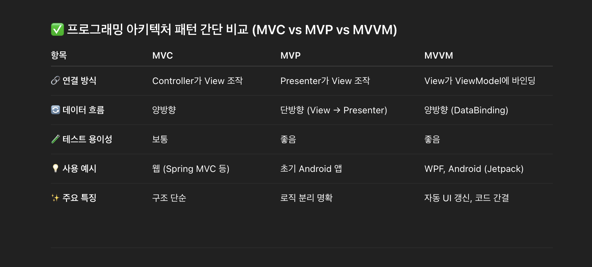

<pre>

  프로그래밍 아키텍처 패턴 비교

· MVC, MVP, MVVM 패턴의 구조와 특징

</pre>

<pre>
* MVC (Model - View - Controller)

1. 구조

- Model: 앱의 핵심 데이터랑 비즈니스 로직을 담당한다.

- View: 사용자에게 보여지는 화면(UI)을 담당한다.

- Controller: 사용자 입력을 받아서 처리하고, 필요한 Model을 호출하거나 View를 갱신한다.

2. 특징

- 사용자의 입력은 Controller가 받고, 처리한 결과는 Model에 반영한다.

- View는 Model의 데이터를 직접 참조해서 화면을 보여준다.

- View와 Model, Controller 사이의 연결이 비교적 느슨하지 않아서 서로 얽히기 쉽다.

- 웹 프레임워크(Spring MVC, Rails 등)에서 자주 쓰인다.

- 프로젝트 규모가 커지면 Controller가 역할이 많아져서 복잡해지기 쉽다. (Fat Controller 문제)

* MVP (Model - View - Presenter)

1. 구조

- Model: 데이터랑 비즈니스 로직을 담당한다.

- View: 화면을 구성하는 역할만 하고, 로직은 거의 없다. 보통 인터페이스로 정의한다.

- Presenter: View에서 이벤트를 전달받아 Model을 조작하고, 결과를 View에 다시 전달한다.

2. 특징

- View랑 Presenter는 1:1로 연결되는 경우가 많다.

- View는 Presenter에 의존하지만, Presenter는 View의 인터페이스만 참조해서 테스트하기 좋다.

- View는 거의 수동적으로 동작하고, 대부분의 로직은 Presenter가 처리한다.

- 안드로이드 초창기 때 많이 쓰였고, 구조가 깔끔해서 유지보수가 쉽다.

  다만 Presenter가 너무 많은 일을 하게 되면 코드가 복잡해질 수 있다.

* MVVM (Model - View - ViewModel)

1. 구조

- Model: 데이터랑 비즈니스 로직을 담당한다.

- View: 사용자에게 보여지는 화면(UI)을 담당하고, ViewModel이랑 데이터 바인딩된다.

- ViewModel: View의 상태와 데이터를 관리하면서 Model과 통신한다. View랑은 바인딩을 통해 연결된다.

2. 특징

- View와 ViewModel은 데이터 바인딩으로 연결돼서, 값이 바뀌면 UI가 자동으로 갱신된다.

- ViewModel은 View를 참조하지 않아서 테스트하기가 매우 쉽다.

- 복잡한 UI를 깔끔하게 관리할 수 있어서 안드로이드, WPF, SwiftUI, Jetpack Compose 같은 프레임워크에서 많이 쓰인다.

- 단점은 바인딩 구조가 복잡해질 경우 디버깅이 어려울 수 있다는 점이다.

</pre>
